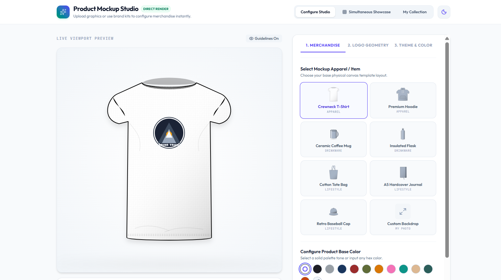

<div align="center">
  

  <h1>🎨 LogoMock</h1>
  <p><strong>Your Ultimate AI-Powered Logo Mockup Generator</strong></p>

  <p>
    <a href="https://logomock.vercel.app">View Live App</a> •
    <a href="#features">Features</a> •
    <a href="#tech-stack">Tech Stack</a> •
    <a href="#getting-started">Getting Started</a>
  </p>
</div>

---

## 🚀 What is LogoMock?

**LogoMock** is an interactive web application that bridges the gap between imagination and reality. Powered by Google's cutting-edge **Gemini API**, LogoMock allows you to effortlessly generate custom logos and instantly visualize them mapped onto beautiful product mockups—all in real-time. 

Say goodbye to complex design software; just type your idea and see it come to life on merchandise!

<a name="features"></a>
## ✨ Features

- **🧠 AI Logo Generation:** Harness the power of Gemini to create unique logos from text prompts.
- **👕 Real-time Mockups:** Instantly preview your generated logos on various product mockups (t-shirts, mugs, etc.).
- **⚡ Lightning Fast:** Built with Vite for rapid development and optimized production builds.
- **🎭 Smooth Animations:** Enhanced with Framer Motion for a fluid, delightful user experience.
- **🎨 Beautiful UI:** Styled with Tailwind CSS v4 and Lucide React icons.

<a name="tech-stack"></a>
## 🛠️ Tech Stack

- **Frontend Framework:** React 19 + Vite
- **Styling:** Tailwind CSS v4
- **Animations:** Framer Motion
- **Icons:** Lucide React
- **AI Integration:** `@google/genai` (Gemini API)
- **Language:** TypeScript

<a name="getting-started"></a>
## 🏎️ Getting Started

Want to run LogoMock locally? Follow these simple steps:

### Prerequisites
Make sure you have [Node.js](https://nodejs.org/) installed on your machine.

### Installation

1. **Clone the repository** (if you haven't already):
   ```bash
   git clone https://github.com/Mintsolester/LogoMock.git
   cd LogoMock
   ```

2. **Install dependencies:**
   ```bash
   npm install
   ```

3. **Set up your environment variables:**
   - Rename `.env.example` to `.env.local` (or create a new `.env.local` file).
   - Add your Google Gemini API key:
   ```env
   GEMINI_API_KEY=your_api_key_here
   ```

4. **Start the development server:**
   ```bash
   npm run dev
   ```

5. **Open your browser** and visit `http://localhost:3000` to see your app in action!

## 🌐 Deployment

This app is optimized for seamless deployment. We recommend deploying on **Vercel** for the best experience. The production URL is currently live at [logomock.vercel.app](https://logomock.vercel.app).

---
<div align="center">
  <i>Built with ❤️ and powered by Google Gemini</i>
</div>
